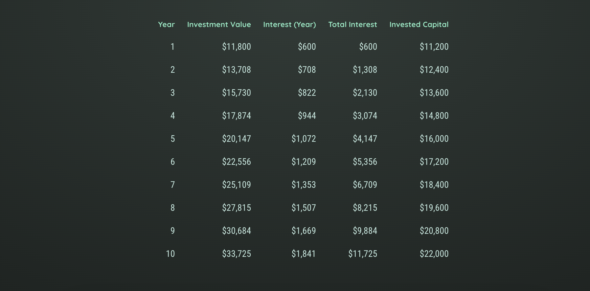

# 💰 Investment Calculator

## 🎯 Genel Bakış

React kullanılarak geliştirilmiş bir Yatırım Hesaplama Aracı. Kullanıcılar, başlangıç yatırımı, yıllık yatırım tutarı, faiz oranı ve yatırım süresi gibi bilgileri girerek yıllık yatırım değerlerini, faizlerini ve toplam yatırım sonuçlarını görüntüleyebilir.

## 🛠️ Kullanılan Teknolojiler

- **React**
- **JavaScript**
- **CSS**

## 🚀 Özellikler

- Dinamik Hesaplama: Kullanıcının girdiği verilerle yatırım sonuçlarını otomatik olarak hesaplar.
- Yatırım Tablosu: Yıllık yatırım değeri, faiz ve toplam faiz gibi veriler tablo halinde gösterilir.
- Temiz ve Kullanıcı Dostu Arayüz: Kullanıcıların girdilerini kolayca değiştirmesine olanak tanır.
- Yatırım Başlangıcını Hesaplama: İlk yatırılan sermayeyi ve yıllık faizleri ayrı ayrı gösterir.

## 🕹️ Nasıl Kullanılır

1. Başlangıç Yatırımı: İlk yatırdığınız miktarı girin.
2. Yıllık Yatırım Tutarı: Her yıl eklemek istediğiniz yatırım tutarını belirleyin.
3. Faiz Oranı: Yıllık faiz oranını yüzde (%) cinsinden girin.
4. Yatırım Süresi: Kaç yıl boyunca yatırım yapacağınızı seçin.
5. Sonuçları Görüntüleyin: Tablo üzerinden yıllık bazda yatırım sonuçlarını ve toplam değerleri inceleyin.

## 📸 Ekran Görüntüleri

- **Giriş Ekranı**
  

- **Sonuç Tablosu**
  

## ⚙️ Kurulum ve Çalıştırma

1. Bu projeyi klonlayın:
   ```bash
   git clone <https://github.com/busracogul/investment-calculator.git>
   cd investment-calculator
   ```
2. Bağımlılıkları yükleyin:
   ```bash
   npm install
   ```
3. Geliştirme sunucusunu başlatın:
   ```bash
   npm run dev
   ```
4. Uygulamayı tarayıcınızda görüntüleyin:
   ```bash
   http://localhost:5173
   ```

## Canlı Proje Linki

Projeyi canlıda görmek için [buraya tıklayın](https://investment-calculator-react-project.vercel.app).
